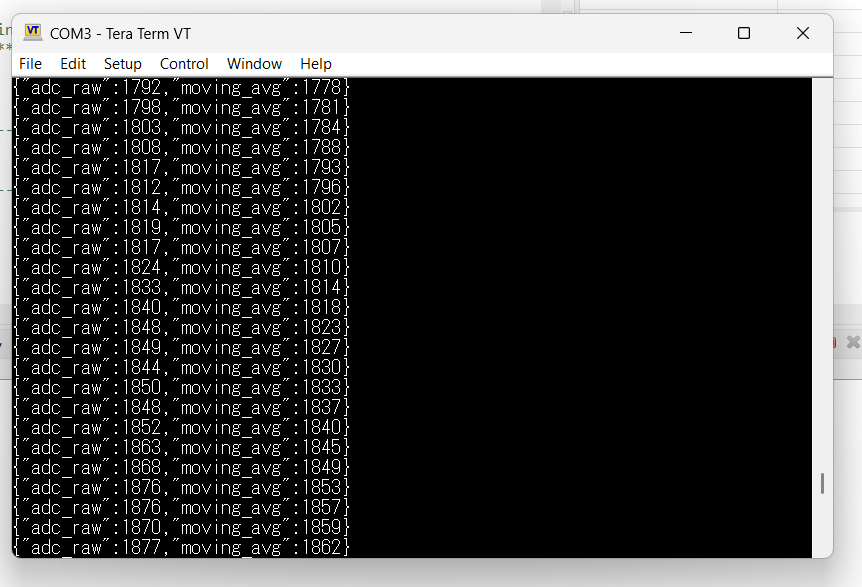
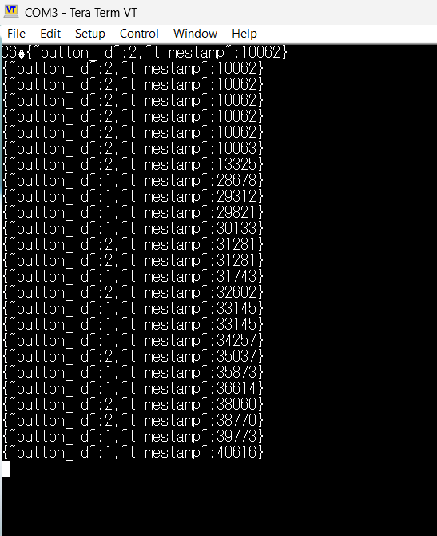

# IoT Firmware Engineer Technical Assessment

This repository contains my implementation for the IoT Firmware Engineer technical assessment.

The assessment covers STM32 HAL-based firmware development, FreeRTOS task synchronization, UART communication, JSON data formatting, and ESP32-based wireless connectivity.

---

## Repository Structure

```text
Cureous-IoT-Firmware-Assessment/
│
├── README.md
│
├── Task-1/
│   └── [Option B implementation - in progress]
│
├── Task-2/
│   ├── main.c
│   └── task2-output.png
│
└── Task-3/
    ├── main.c
    ├── task3-output.png
    └── task3-hardware.png
```

---

# Hardware Used

## STM32

- NUCLEO-F401RE development board
- STM32F401RE MCU

## Task 2

- Analog soil moisture sensor
- NUCLEO-F401RE
- USB cable
- PC
- Tera Term

## Task 3

- NUCLEO-F401RE
- 2 × Push buttons
- Breadboard
- Jumper wires
- USB cable
- PC
- Tera Term

## Task 1 – Option B

- NUCLEO-F401RE
- ESP32-WROOM-32
- USB/UART connection
- PC
- Wi-Fi network

---

# Task 1 – STM32 Host + ESP32 Modem

## Option B – STM32 Host + ESP32 Modem

**Status:** In Progress

The selected approach for Task 1 is Option B, where the STM32 acts as the host microcontroller and the ESP32 is used as a wireless modem.

The STM32 communicates with the ESP32 through UART and controls the ESP32 using AT commands.

### Planned Architecture

```text
              UART
STM32 F401RE <-------> ESP32-WROOM-32
      │                       │
      │                       │
      │                       └── Wi-Fi
      │
      └── Debug UART
              │
              ▼
           Tera Term
```

### Planned Features

- Dynamic Wi-Fi credential provisioning
- ESP32 initialization using AT commands
- Wi-Fi station mode configuration
- Wi-Fi connection using AT commands
- MQTT/cloud connectivity
- Heartbeat message every 30 seconds
- Asynchronous UART receive monitoring
- Wi-Fi reconnection handling

### Main AT Command Flow

```text
AT
AT+CWMODE=1
AT+CWJAP="SSID","PASSWORD"
```

The final Task 1 implementation and test results will be added after completion.

---

# Task 2 – STM32 ADC Sensor Sampling & JSON UART Streaming

## Objective

Implement periodic ADC sampling on the STM32, calculate a moving average of the ADC samples, and transmit the result through UART in JSON format.

The assessment specifies:

- ADC sampling at 10 Hz
- 100 ms sampling interval
- Moving average using 10 samples
- UART transmission of the processed value
- JSON-formatted output

## Hardware

- NUCLEO-F401RE
- Analog soil moisture sensor
- USB cable
- PC
- Tera Term

## Implementation

The ADC is configured to read the analog sensor connected to the ADC input.

A TIM2 timer interrupt generates a sampling event every 100 ms.

The timer callback only sets a flag. The actual ADC conversion and UART transmission are handled in the main application loop.

### Data Processing

```text
Analog Sensor
      │
      ▼
   ADC1 / PA0
      │
      ▼
 ADC Raw Value
      │
      ▼
10-Sample Moving Average
      │
      ▼
 JSON Formatting
      │
      ▼
 USART2 @ 115200 baud
      │
      ▼
   Tera Term
```

## Moving Average

A 10-sample moving average is implemented using a running sum.

```text
Moving Average = Sum of Samples / Number of Samples
```

The buffer is updated continuously as new ADC values are received.

## UART Configuration

```text
Baud Rate : 115200
Data Bits : 8
Stop Bits : 1
Parity    : None
Flow Ctrl : None
```

## JSON Output

Example output:

```json
{"adc_raw":1792,"moving_avg":1778}
{"adc_raw":1798,"moving_avg":1781}
{"adc_raw":1803,"moving_avg":1784}
{"adc_raw":1808,"moving_avg":1788}
```

## Output Evidence

The Tera Term output demonstrates continuous ADC sampling and moving-average calculation.



## Demonstration Video

[Watch Task 2 – STM32 ADC Sensor Sampling](https://youtu.be/AtXbA7fcL-c)

---

# Task 3 – FreeRTOS Task Synchronization & Logging

## Objective

Implement a FreeRTOS producer-consumer architecture using GPIO external interrupts, a message queue, and a UART logger task.

The system captures button events from GPIO EXTI interrupts and transfers the event information to a FreeRTOS queue.

The logger task receives the event from the queue and transmits the information as JSON over UART.

## Hardware

- NUCLEO-F401RE
- 2 × Push buttons
- Breadboard
- Jumper wires
- USB cable
- PC
- Tera Term

## Button Configuration

### Button 1

```text
GPIO: PC13
Button ID: 1
```

### Button 2

```text
GPIO: PA0
Button ID: 2
```

Both buttons are configured to generate falling-edge EXTI interrupts.

## Architecture

```text
             Button 1 / Button 2
                      │
                      ▼
                 GPIO EXTI
                      │
                      ▼
             EXTI Callback
                 Producer
                      │
                      ▼
              FreeRTOS Queue
                      │
                      ▼
                Logger Task
                 Consumer
                      │
                      ▼
              JSON Formatting
                      │
                      ▼
             USART2 @ 115200
                      │
                      ▼
                  Tera Term
```

## Producer

The GPIO EXTI callback performs the following operations:

1. Identifies the button.
2. Captures the FreeRTOS system tick.
3. Creates a `ButtonEvent_t` structure.
4. Places the event into the FreeRTOS message queue.

UART transmission is not performed inside the interrupt callback.

## Consumer

The `LoggerTask` waits for an event from the queue.

When an event is received:

1. Button ID and timestamp are extracted.
2. The event is converted into JSON.
3. The JSON message is transmitted through USART2.

The logger task blocks while the queue is empty, avoiding unnecessary polling.

## Event Structure

```c
typedef struct
{
    uint32_t button_id;
    uint32_t timestamp;
} ButtonEvent_t;
```

## UART Configuration

```text
Baud Rate : 115200
Data Bits : 8
Stop Bits : 1
Parity    : None
Flow Ctrl : None
```

## Example Output

```json
{"button_id":2,"timestamp":10062}
{"button_id":1,"timestamp":29312}
{"button_id":2,"timestamp":31281}
{"button_id":1,"timestamp":33145}
```

## Hardware Setup


The hardware setup uses the NUCLEO-F401RE with two push buttons connected through a breadboard.

## Output Evidence



The Tera Term output demonstrates button event detection, timestamp capture, FreeRTOS queue processing, and JSON UART logging.

## Demonstration Video

[Watch Task 3 – FreeRTOS Button Event Logging](https://youtu.be/Atw_Tc31nyw)

---

# Build and Flash

## STM32CubeIDE

The STM32 firmware was developed using STM32CubeIDE.

General procedure:

1. Open the STM32 project in STM32CubeIDE.
2. Configure the required peripherals using STM32CubeMX configuration.
3. Build the project.
4. Connect the NUCLEO-F401RE through USB.
5. Flash the firmware using the ST-LINK debugger/programmer.
6. Open Tera Term and select the appropriate COM port.
7. Configure the terminal for:

```text
Baud Rate : 115200
Data Bits : 8
Stop Bits : 1
Parity    : None
Flow Ctrl : None
```

8. Reset the STM32 board.
9. Observe the JSON output in Tera Term.

---

# Task 2 Testing Procedure

1. Connect the analog soil moisture sensor to the ADC input.
2. Connect the NUCLEO-F401RE to the PC.
3. Flash the Task 2 firmware.
4. Open Tera Term.
5. Select the STM32 virtual COM port.
6. Configure the terminal to 115200 baud.
7. Observe the ADC raw value and moving average.
8. Change the sensor input and verify that the ADC value changes.
9. Verify that the moving average changes smoothly compared with the raw ADC value.

Expected format:

```text
{"adc_raw":<value>,"moving_avg":<value>}
```

---

# Task 3 Testing Procedure

1. Connect Button 1 to PC13.
2. Connect Button 2 to PA0.
3. Connect the NUCLEO-F401RE to the PC.
4. Flash the Task 3 firmware.
5. Open Tera Term at 115200 baud.
6. Press Button 1.
7. Verify that `button_id` is `1`.
8. Press Button 2.
9. Verify that `button_id` is `2`.
10. Verify that a timestamp is generated for every detected event.

Expected format:

```text
{"button_id":1,"timestamp":<value>}
{"button_id":2,"timestamp":<value>}
```

---

# Software and Tools

- STM32CubeIDE
- STM32 HAL
- FreeRTOS / CMSIS-RTOS
- ESP32 AT firmware for Task 1
- Tera Term
- GitHub
- YouTube for demonstration videos

---

# Assessment Status

| Task | Description | Status |
|------|-------------|--------|
| Task 1 | STM32 Host + ESP32 Modem – Option B | In Progress |
| Task 2 | STM32 ADC + Moving Average + JSON UART | Completed |
| Task 3 | FreeRTOS Queue + GPIO EXTI + JSON UART | Completed |

---

# Demonstration Videos

### Task 2

[STM32 ADC Sensor Sampling – Demonstration](https://youtu.be/AtXbA7fcL-c)

### Task 3

[STM32 FreeRTOS Button Event Logging – Demonstration](https://youtu.be/Atw_Tc31nyw)

---

# Author

**B NANDIVARDHAN REDDY**

IoT / Embedded Systems Engineering

GitHub Repository:

`Cureous-IoT-Firmware-Assessment`
